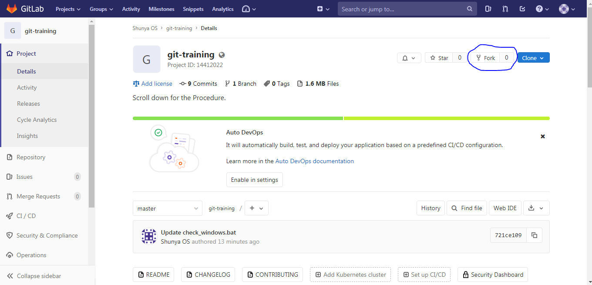

# IoTIoT.in On Boarding

How to read this document ? 

You must have atleast 15 mins of free time, stable Internet, to complete all steps given here.

## Step 1 : Fork the Repository 



### For Advanced users

#### Note : For next Step to work you may need to install git on your machine
For Linux users [follow these steps](https://www.atlassian.com/git/tutorials/install-git#linux)  
For Windows users [follow these steps](https://www.atlassian.com/git/tutorials/install-git#windows)

2. Clone this repository
```
git clone https://gitlab.com/shunyaos/git-training.git
```
3. Run a script using command given below in the terminal

#### For Linux users
```shell
cd git-training
./check_linux.sh
```
#### For Windows users
1. Press Windos + R on keyboard
2. Type cmd and press Enter
```shell
cd git-training
check_windows.bat
```
5. Commit all your changes (include all  files in your directory)
```
git commit -m "Ran script"
```
6. Push the changes to the remote repository
```
git push
```


# Contribute
Do you have any suggestions to improve this project ? 

Then Please open up an Issue in the project on Gitlab and let us discuss your Ideas/suggestions in detail. Please follow our [contributing guidelines](CONTRIBUTING.md).
